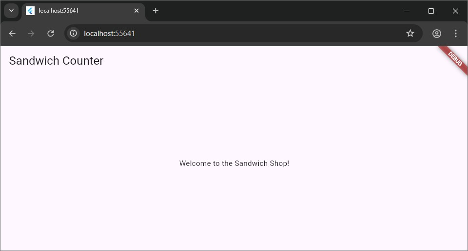

# Sandwich Shop

A small Flutter app for ordering sandwiches — a demo shop that showcases
state management, a lightweight repository layer, and a simple UI for
browsers, mobile, and desktop targets.

**Quick read:** clone the repo, run `flutter pub get`, then `flutter run`.

**Features**
- **Ordering flow**: browse menu, add items to a cart, and checkout.
- **Persistence**: saves orders locally using the app's `services` layer.
- **Modular layout**: `models`, `repositories`, `services`, `views`, and `widgets`.

**Prerequisites**
- **Flutter SDK**: install and verify with `flutter doctor`.
- **Dart SDK**: comes with Flutter; ensure versions match your Flutter channel.
- **A device or emulator**: browser (Chrome), mobile device, or desktop target.

**Getting started**
- **Clone**: `git clone <repo-url>` then `cd sandwich_shop`.
- **Install deps**: `flutter pub get`.
- **Run (default)**: `flutter run` (choose a device when prompted).
- **Run for web**: `flutter run -d chrome`.
- **Run for Windows/macOS/Linux**: `flutter run -d windows` (or `-d macos` / `-d linux`).

**Tests**
- **Unit & widget tests**: `flutter test` (runs tests under `test/`).
- **Integration tests**: look in `integration_test/` and run with Flutter's
    integration testing tooling (example: `flutter drive` or `flutter test integration_test`).

**Project structure (top-level)**
- `lib/`: application source code
    - `main.dart`: app entrypoint
    - `models/`: data models (e.g., `sandwich.dart`, `cart.dart`)
    - `repositories/`: pricing and data access
    - `services/`: platform services (database, persistence)
    - `views/` and `widgets/`: UI screens and reusable widgets
- `assets/` and `images/`: media and static assets
- `test/`: unit & widget tests
- `integration_test/`: end-to-end tests

**Common tasks**
- Get dependencies: `flutter pub get`.
- Run app: `flutter run` or target a device with `-d`.
- Run tests: `flutter test`.
- Format code: `dart format .`.

**Issues**
- Open issues in the repository for bugs or requested features.
